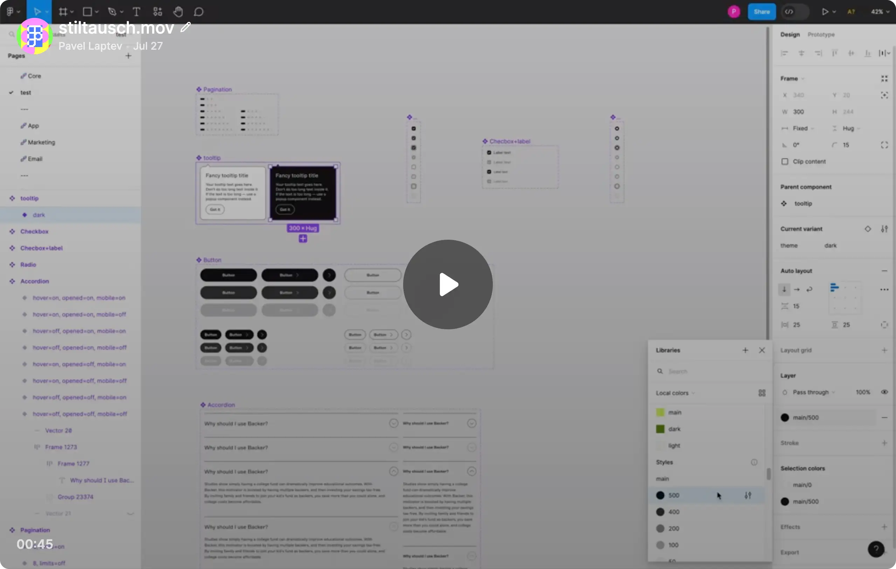

# StilTausch ✷ Swap Styles with Variables

StilTausch is a [parameter Figma plugin](https://help.figma.com/hc/en-us/articles/4406468726167-Plugin-parameters) that allows you to swap styles with variables.

Here are two basic commands:

1. **Swap all** — This command will swap all styles with the same names.
2. **Swap manually** — This command will swap styles by their names.

## How It Works

Install the plugin from the [plugin page](https://www.figma.com/community/plugin/1265414931203814032).
Since it's a [quick action](https://help.figma.com/hc/en-us/articles/360040328653#Quick_actions) plugin, you can run it from the quick action menu:

- Mac: ⌘ Command / or ⌘ Command P
- Windows: Control + / or Control + P

### Basic Principle

The plugin fetches all collections from a team library that you're using in the document, and after providing a collection name, the plugin will fetch all variables from this collection.

### Usage Recommendations

Each command can also be run for the current page only or for the whole document.
**Note**: In terms of heavy documents with many styles, it could be useful to run the command for the current page only.

The plugin will skip styles if they are in `INSTANCE` nodes. If you want to swap styles in `INSTANCE` nodes, you need to detach them first or go to the master component and swap styles there.

_Watch the video below to see how it works:_

---

### "Swap all" Command

With this option, you can swap all styles with the same names. Before the plugin starts to swap styles, it will ask you to select a collection. Just start typing a collection name you want to use, and the plugin will show you a list of suggestions. After selecting a collection, hit the `Enter` key, and the plugin will start to swap styles.

The plugin will compare variable names from the collection you choose with style names of each node in the document. If the plugin finds a match, it will swap the style with the variable.

---

### "Swap manually" Command

This command will swap styles by their names. The plugin will ask you to provide:

1. A style name you want to swap.
2. A collection name from which the plugin will fetch variables.
3. A variable name you want to use for swapping.

After providing all the information, hit the `Enter` key, and the plugin will start to swap styles.

---

## Feedback

If you have any questions or suggestions, feel free to leave a comment on the [plugin page](https://www.figma.com/community/plugin/1265414931203814032) or [create an issue](https://github.com/PavelLaptev/StilTausch-Swap-styles-with-variables/issues) on GitHub.
